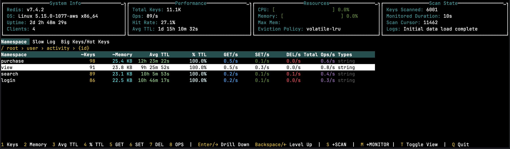

# RedScout - Redis Namespace Monitor



RedScout is a Redis monitoring tool that provides namespace-level insights into your Redis database unlike
traditional tools that focus more on server-level metrics. It breaks down memory usage, key TTLs, and OP/s by logical
namespaces, giving you clear visibility into which parts of your application are driving Redis usage. RedScout can also
handle deeply nested key patterns like `user:<user-id>:messages:unread` or `user:<user-id>:order:<order-id>:status`, helping
you pinpoint hotspots with precision.

## How It Works

RedScout leverages three core Redis commands: `SCAN`, `MEMORY USAGE`, and `MONITOR` to assemble a namespace-level
view of your cache. On top of these, it accepts configurable inputs such as a custom delimiter for splitting key
hierarchies and regular expressions to automatically identify and infer id components within your keys.

## Requirements

- **Redis Version**: 4.0.0 or higher (required for `MEMORY USAGE` command)

## Installation

Download the appropriate binary for your platform from the releases page.

## Usage

```bash
./redscout \
  -host redis.example.com \
  -port 6379 \
  -password "your-password" \
  -tls true \
  -monitor-duration 30 \
  -scan-size 10000
```

## Configuration Options

### Connection Settings

| Flag        | Type   | Default   | Description                               |
|-------------|--------|-----------|-------------------------------------------|
| `-host`     | string | _(empty)_ | Redis host address                        |
| `-port`     | int    | `6380`    | Redis port number                         |
| `-password` | string | _(empty)_ | Redis password for authentication         |
| `-db`       | int    | `0`       | Redis database number to analyze          |
| `-tls`      | string | `false`   | Use TLS for Redis connection (true/false) |

### Analysis Settings

| Flag                | Type   | Default   | Description                                                   |
|---------------------|--------|-----------|---------------------------------------------------------------|
| `-delimiter`        | string | `:`       | Delimiter for separating Redis keys into namespaces           |
| `-scan-size`        | int    | `5000`    | Number of keys to scan                                        |
| `-monitor-duration` | int    | `10`      | Duration in seconds to run the `monitor` command              |
| `-refresh-interval` | int    | `5`       | Interval in seconds between Redis info refreshes              |
| `-id-regex`         | string | _(empty)_ | Space-separated list of regex patterns to infer IDs from keys |

### Output Settings

| Flag        | Type   | Default         | Description                                |
|-------------|--------|-----------------|--------------------------------------------|
| `-logs-dir` | string | _OS's temp dir_ | Directory to store temporary analysis logs |

## Notes

- Uses Redis [MONITOR](https://redis.io/docs/latest/commands/monitor/) command, so be careful when using in production
  environments
- Results are estimates based on sampling, not exhaustive key scanning
